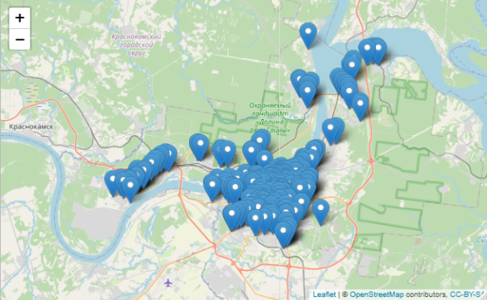
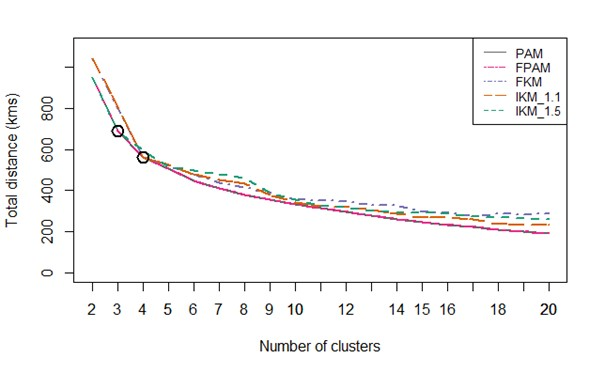
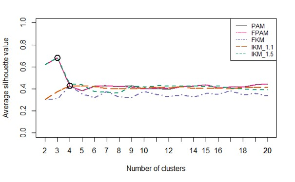
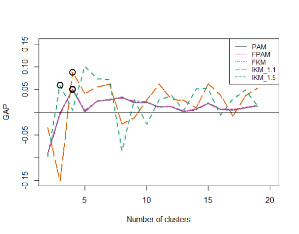
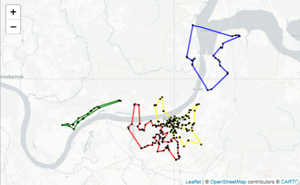

# Clustering_and_TSP_with_R
## Application of a Traveling Salesman Problem with Independent Clusters in R
This project is based on the paper **An Application of a Traveling Salesman Problem with Independent Clusters for Cash Collection Routing**.
As the title indicates we have a data set of geographical positions given, and we split it into different clusters and find independent Traveling Salesman Tours for each one.
In this project, we take a look at pre-implemented heuristics for clustering and the Traveling Salesman Problem (TSP). We decide on the number of clusters based on three different determining methods, which are coded, modified, or pre-existing.
In more detail:
- Clustering Methods
  - Package: cluster
    - Partitioning Around Medoids (PAM)
    - Fast PAM (FPAM)
  - Package: kmed
    - Simple and fast k-medoid algorithm (FKM)
    - Increasing number of clusters in k-medoids algorithm (IKM)
    - Rank k-medoid algorithm (RKM)
- Cluster Number Determining Methods
  - Elbow Method (EM)
  - Average Silhouette Methode (ASM) from Package: cluster
  - Gap Statistic Methode (GSM) with modifications from https://github.com/echen/gap-statistic/blob/master/gap-statistic.R 
- TSP
  - Package: TSP
    - Nearest Neighbor (NN)
    - Nearest Neighbor Repeat (NNR)
    - Nearest Insertion (NI)
    - Farthest Insertion (FI)
    - Cheapest Insertion (CI)
    - Arbitrary Insertion (AI)
    - Two-Opt (2O) we apply this one on all the other methods too

## How to use?
As this should work as a guidebook, if you have R installed, you just need to download the file, extract it and open the main file 'Clustering_and_TSP' in R. After installing all packages the code should run without any further coding.
In lines 44-47 we get a first overview of our data on the map.
From line 50-70 we define the TD and go on with the EM in 73-86.
We apply the EM on our data for the different clustering methods and show the result graphically in the next block (89-180).
The next two blocks are ASM in lines 183-293 and GSM in 298-594. 

We start with the TSP in line 600, we give the number of clusters manually in our case 4. 
After splitting our data into the found clusters (617-632), we show one example for the clustering before we take 5000 runs with every method, find the overall minimum of them, and show the result on the map (635-829). In the last block, we find the shortest tour with our heuristics for the unclustered version of our data points.

The other R file is to get the graphics of the different clustering methods.

## Screenshots
For easier understanding we work with graphics:

We begin with plotting our data on a map:
> 

The results for the cluster number determining tests will be given back as graphics. 
For the EM, ASM, and GSM
> 
>  
> 

Or the tours:
> 

